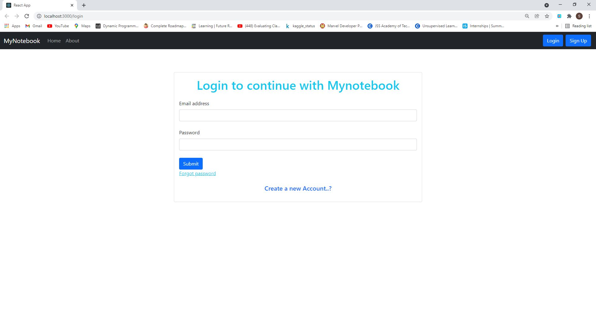

# MyNoteBook

This a app where you can access and create Note anywhere.

## Features

- Developed a fully working website using MERN - Stack.
- To create note user needs to authenticate.
- Email verification and reset password functionality introduced.
- User which is logged in can only see his/her notes.
- Technologies Used: MongoDB, Node.js, React.js, Express.js, and Context api.
- User can search their notes by title.
- User can sort their notes according to date.
<a href="https://cocky-banach-fc4ecb.netlify.app/" target="_blank">Live Link</a> 
Github Repository : https://github.com/Suraj-tech20/mynotebook

  
## ScreenShots

### Home Screen

### Searching

### Login Screen

### SignUp Screen

### Forgot Password Screen

  